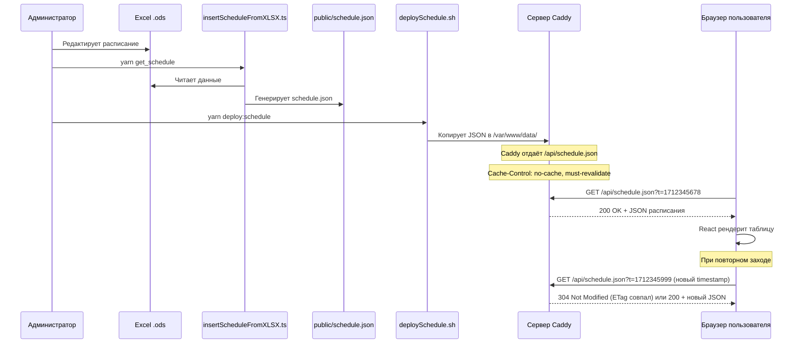

# План миграции: статическое расписание → динамическая загрузка с сервера

## Текущая архитектура (проблема)

```
[Excel .ods] → insertScheduleFromXLSX.ts → schedule.ts (TypeScript)
                                                      ↓
                                              React import (build-time)
                                                      ↓
                                              TableContent.tsx использует
                                              schedule[activeDay] напрямую
```

**Минусы:** при каждом изменении расписания нужен ребuild и деплой всего приложения.

## Целевая архитектура

```
[Excel .ods] → insertScheduleFromXLSX.ts → schedule.json (JSON)
                                                 ↓
                                          SCP/SFTP на сервер
                                                 ↓
                              /var/www/data/schedule.json (статический файл)
                                                 ↓
                              Caddy отдаёт по URL /api/schedule.json
                              с заголовками против кеширования
                                                 ↓
                              React → fetch(/api/schedule.json) при монтировании Seance.tsx
                                                 ↓
                              TableContent.tsx использует данные из состояния
```

**Плюсы:** обновление расписания = генерация JSON + копирование на сервер. Без ребuilda.

---

## Стратегия борьбы с кешированием

Проблема в 3 уровнях кеша:

| Уровень | Проблема | Решение |
|---------|----------|---------|
| **Caddy (сервер)** | Может закешировать ответ и не отдавать новый файл | Добавить `header Cache-Control no-cache` в Caddyfile |
| **Браузер (HTTP-кеш)** | Браузер может не делать повторный запрос | 1) `Cache-Control: no-cache` + `ETag` в Caddy<br>2) Добавить `?t=timestamp` к URL в fetch |
| **React/Redux (кеш приложения)** | Если пользователь не перезагрузит страницу, данные устареют | При каждом заходе на Seance делать новый fetch (useEffect без зависимостей кеша) |

### Детальное решение по каждому уровню

#### 1. Caddy — заголовки кеширования

В Caddyfile для маршрута `/api/schedule.json`:

```
handle_path /api/schedule.json {
    root * /var/www/data
    file_server
    header Cache-Control "no-cache, must-revalidate"
    header Pragma "no-cache"
    header Expires "0"
}
```

- `no-cache` — браузер обязан проверять с сервером, не изменился ли файл
- `must-revalidate` — при возврате со страницы назад/вперёд тоже перепроверять
- Caddy по умолчанию использует `ETag` (хэш содержимого файла), поэтому браузер будет делать `If-None-Match` запрос и получать `304 Not Modified`, если файл не изменился

#### 2. Браузер — cache-busting через query-параметр

В хуке `useSchedule` добавить к URL timestamp, чтобы гарантированно обходить кеш:

```typescript
const cacheBuster = `?t=${Date.now()}`;
fetch(`/api/schedule.json${cacheBuster}`)
```

Это гарантирует, что даже если Caddy по какой-то причине не выставит заголовки, браузер сделает новый запрос.

#### 3. React — свежие данные при каждом заходе

- fetch делается в `useEffect` при монтировании `Seance.tsx`
- При размонтировании (уход со страницы) ничего не чистим
- При повторном монтировании — снова fetch с новым timestamp

---

## Пошаговый план

### Этап 1: Модифицировать скрипт генерации расписания

**Файл:** `ExternalScripts/Excel/insertScheduleFromXLSX.ts`

**Что сделать:**
- Изменить вывод: вместо `schedule.ts` генерировать `public/schedule.json`
- Формат JSON — точно такой же, как текущий объект schedule, но в JSON
- `schedule.ts` можно удалить или оставить как fallback (но из импортов убрать)

**Изменение:**
```typescript
// Вместо:
const finalData = `export const schedule = ${JSON.stringify(finalSchedule)}`;
fs.writeFileSync('src/Content/Seance/schedule.ts', finalData);

// Сделать:
fs.writeFileSync('public/schedule.json', JSON.stringify(finalSchedule, null, 2));
```

**Результат:** при запуске `yarn get_schedule` создаётся `public/schedule.json`.

---

### Этап 2: Настроить Caddy для отдачи JSON

**Файл:** `Caddyfile` (на сервере)

**Что сделать:**
- Добавить маршрут `/api/schedule.json`, который указывает на статический файл
- Файл будет лежать в отдельной директории (не в `dist/`, чтобы не сбрасывался при деплое)
- Выставить заголовки против кеширования

**Конфигурация Caddy:**
```
example.com {
    root * /var/www/react_sovremennik/dist
    file_server

    # API endpoint для расписания (без кеширования)
    handle_path /api/schedule.json {
        root * /var/www/data
        file_server
        header Cache-Control "no-cache, must-revalidate"
        header Pragma "no-cache"
        header Expires "0"
    }

    # SPA fallback
    handle {
        try_files {path} /index.html
        file_server
    }
}
```

**Структура на сервере:**
```
/var/www/
├── react_sovremennik/
│   └── dist/          # билд приложения (перезаписывается при деплое)
└── data/
    └── schedule.json   # расписание (живёт отдельно, не сбрасывается)
```

**Результат:** `https://example.com/api/schedule.json` отдаёт актуальное расписание без кеширования.

---

### Этап 3: Создать хук `useSchedule`

**Новый файл:** `src/hooks/useSchedule.ts`

**Что делает:**
- При вызове делает `fetch('/api/schedule.json?t=timestamp')` — cache-busting через query-параметр
- Возвращает `{ schedule, isLoading, error }`
- Типизирует ответ

```typescript
import { useEffect, useState } from 'react';
import type { DateKeysT } from '@/REDUX/seance/seanceReducerT';

type ScheduleDataT = Record<DateKeysT, Array<[string, string, string, string]>>;

type UseScheduleResult = {
  schedule: ScheduleDataT | null;
  isLoading: boolean;
  error: string | null;
};

export function useSchedule(): UseScheduleResult {
  const [schedule, setSchedule] = useState<ScheduleDataT | null>(null);
  const [isLoading, setLoading] = useState(true);
  const [error, setError] = useState<string | null>(null);

  useEffect(() => {
    let cancelled = false;
    const cacheBuster = `?t=${Date.now()}`;

    fetch(`/api/schedule.json${cacheBuster}`)
      .then(res => {
        if (!res.ok) throw new Error(`HTTP ${res.status}`);
        return res.json();
      })
      .then(data => {
        if (!cancelled) setSchedule(data as ScheduleDataT);
      })
      .catch(err => {
        if (!cancelled) setError(err.message);
      })
      .finally(() => {
        if (!cancelled) setLoading(false);
      });

    return () => { cancelled = true; };
  }, []);

  return { schedule, isLoading, error };
}
```

**Результат:** появился переиспользуемый хук для загрузки расписания с защитой от кеширования и утечек памяти (cancelled flag).

---

### Этап 4: Модифицировать `TableContent.tsx`

**Файл:** `src/Content/Seance/seanceComponents/TableContent/TableContent.tsx`

**Что сделать:**
- Убрать прямой импорт `import { schedule } from '@/Content/Seance/schedule.ts'`
- Принимать `schedule` как пропс

**Изменение:**
```typescript
// Было:
import { schedule } from '@/Content/Seance/schedule.ts';

export const TableContent = memo<TableContentT>(
  function TableContent({ activeScheduleItemKey, tableVisible }) {
    if (!(activeScheduleItemKey in schedule)) return null;
    // ...
    {schedule[activeScheduleItemKey as keyof typeof schedule].map(tableItem)}
  },
);

// Стало:
export const TableContent = memo<TableContentT>(
  function TableContent({ activeScheduleItemKey, tableVisible, schedule }) {
    if (!schedule || !(activeScheduleItemKey in schedule)) return null;
    // ...
    {schedule[activeScheduleItemKey as keyof typeof schedule].map(tableItem)}
  },
);
```

---

### Этап 5: Модифицировать `Seance.tsx`

**Файл:** `src/Content/Seance/Seance.tsx`

**Что сделать:**
- Использовать `useSchedule()` для загрузки данных
- Пока данные грузятся — показывать прелоадер
- Если ошибка — показать сообщение об ошибке
- Передавать `schedule` в `TableContent`

**Поток данных:**
```
Seance.tsx
  ├── useSchedule() → { schedule, isLoading, error }
  ├── если isLoading → <div className={s.loader}>Загрузка расписания...</div>
  ├── если error → <div className={s.error}>Ошибка загрузки: {error}</div>
  └── если schedule есть → <TableContent schedule={schedule} ... />
```

---

### Этап 6: Создать скрипт деплоя расписания

**Новый файл:** `ExternalScripts/deploySchedule.sh`

**Что делает:**
- Копирует `public/schedule.json` на сервер по SCP

```bash
#!/bin/bash
set -euo pipefail

SERVER_USER="your_user"
SERVER_HOST="your_server"
SERVER_PATH="/var/www/data/schedule.json"

echo "Deploying schedule to $SERVER_HOST..."
scp public/schedule.json "$SERVER_USER@$SERVER_HOST:$SERVER_PATH"
echo "Schedule deployed successfully!"
```

**В `package.json` добавить:**
```json
"scripts": {
  "deploy:schedule": "bash ExternalScripts/deploySchedule.sh"
}
```

**Результат:** одна команда `yarn deploy:schedule` для обновления расписания на сервере.

---

### Этап 7: Обновить документацию

**Новый файл:** `docs/SCHEDULE_UPDATE.md`

**Описать процесс:**
1. Внести изменения в Excel-файл (`ExternalScripts/Excel/macros.ods`)
2. Запустить `yarn get_schedule` — генерирует `public/schedule.json`
3. Запустить `yarn deploy:schedule` — копирует JSON на сервер
4. Готово! Без ребuilda и деплоя приложения

---

## Схема взаимодействия



---

## Риски и компромиссы

| Риск | Решение |
|------|---------|
| Нет интернета — расписание не загрузится | Показать заглушку "Расписание временно недоступно" |
| Задержка при загрузке | Показывать прелоадер |
| CORS (если API на другом домене) | Не актуально — JSON отдаётся с того же домена |
| Старый JSON в кеше браузера | 3 уровня защиты: Cache-Control + ETag + cache-buster `?t=` |
| Пользователь не перезагрузил страницу, а расписание обновилось | При каждом заходе на Seance — новый fetch (данные живут только в локальном state компонента) |
| Сломался JSON на сервере | Показывать ошибку, но остальной сайт работает |

---

## Итоговый список файлов для изменения/создания

| Файл | Действие |
|------|----------|
| `ExternalScripts/Excel/insertScheduleFromXLSX.ts` | Изменить: вместо schedule.ts писать schedule.json |
| `Caddyfile` (на сервере) | Изменить: добавить маршрут /api/schedule.json + заголовки кеширования |
| `src/hooks/useSchedule.ts` | **Создать**: хук для fetch расписания с cache-busting |
| `src/Content/Seance/Seance.tsx` | Изменить: использовать useSchedule, передавать данные в TableContent |
| `src/Content/Seance/seanceComponents/TableContent/TableContent.tsx` | Изменить: принимать schedule как пропс вместо импорта |
| `ExternalScripts/deploySchedule.sh` | **Создать**: скрипт копирования JSON на сервер |
| `package.json` | Изменить: добавить скрипт `deploy:schedule` |
| `docs/SCHEDULE_UPDATE.md` | **Создать**: документация процесса |