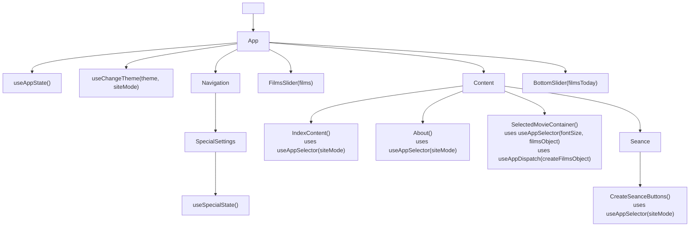
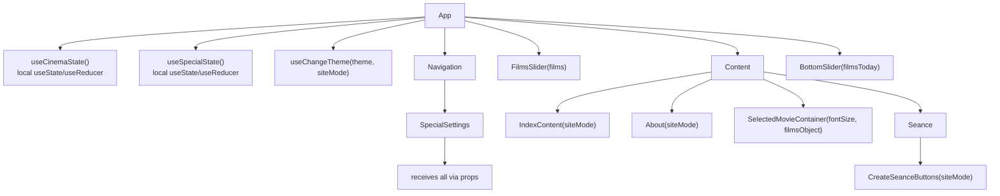

# Redux Removal Plan

## Overview

The application uses Redux for two distinct state domains:

1. **`cinema`** — film data (`films`, `filmsObject`, `filmsToday`, `filmsTodayLinks`)
2. **`special`** — accessibility settings (`siteMode`, `theme`, `fontSize`, `imgHidden`)

Both are small, have no cross-slice dependencies, and are consumed by a limited number of components. Redux adds unnecessary complexity.

---

## Current Architecture



---

## Target Architecture



---

## Detailed Migration Steps

### Phase 1: Extract types to shared location

**What:** Move type definitions from `src/REDUX/cinema/cinemaReducerT.d.ts` and `src/REDUX/special/specialReducerT.d.ts` to `src/types/`.

**Why:** Types are needed by both the old Redux code and the new local state. Keeping them in REDUX/ would create a circular dependency during migration.

**Files to create:**
- `src/types/cinema.ts` — contains `FilmItemT`, `FilmsArrayT`, `CinemaStateT`, `FilmsObjectT`
- `src/types/special.ts` — contains `SpecialStateT`, `SpecialDispatchesT`

**Files to update:**
- All files that import from `@/REDUX/cinema/cinemaReducerT` → `@/types/cinema`
- All files that import from `@/REDUX/special/specialReducerT` → `@/types/special`

**Affected files (import types only):**
| File | Current import | New import |
|------|---------------|------------|
| `src/Content/SelectedMovie/SelectedMovie.tsx` | `@/REDUX/cinema/cinemaReducerT` | `@/types/cinema` |
| `src/Content/SelectedMovie/SelectedMovie.tsx` | `@/REDUX/special/specialReducerT` | `@/types/special` |
| `src/Content/SelectedMovie/DescriptionTrailer.tsx` | `@/REDUX/special/specialReducerT` | `@/types/special` |
| `src/Content/SelectedMovie/SelectedMovieContainer.tsx` | `@/REDUX/cinema/cinemaReducerT` | `@/types/cinema` |
| `src/components/BottomSlider/BottomSlider.tsx` | `@/REDUX/cinema/cinemaReducerT` | `@/types/cinema` |
| `src/components/FilmsSlider/FilmsSlider.tsx` | `@/REDUX/cinema/cinemaReducerT` | `@/types/cinema` |
| `src/components/Navigation/Navigation.tsx` | `@/REDUX/special/specialReducerT` | `@/types/special` |
| `src/components/SpecialSettings/ThemeButtons.tsx` | `@/REDUX/special/specialReducerT` | `@/types/special` |
| `src/components/SpecialSettings/FontButtons.tsx` | `@/REDUX/special/specialReducerT` | `@/types/special` |
| `src/components/SpecialSettings/ImgSwitcher.tsx` | `@/REDUX/special/specialReducerT` | `@/types/special` |
| `src/components/SpecialSettings/SiteModeButton.tsx` | `@/REDUX/special/specialReducerT` | `@/types/special` |
| `src/hooks/useChangeTheme.ts` | `@/REDUX/special/specialReducerT` | `@/types/special` |
| `src/utils/helpers.ts` | `@/REDUX/special/specialReducerT` | `@/types/special` |

---

### Phase 2: Replace cinema Redux state with local state in App.tsx

**Current behavior (Redux):**
- `filmsArray` is imported in `cinemaReducer.ts` as initial state
- `createFilmsTodayArr` is dispatched from `App.tsx` on mount with `LINKS`
- `createFilmsObject` is dispatched from `SelectedMovieContainer.tsx` on mount
- `films`, `filmsToday`, `filmsObject` are read via `useAppSelector`

**New behavior (local state):**
- `films` — derived directly from `filmsArray` (static data, never changes)
- `filmsToday` — computed via `useMemo` in `App.tsx` using `filmsArray` and `LINKS`
- `filmsObject` — computed via `useMemo` in `SelectedMovieContainer.tsx` using `filmsArray`

**Implementation:**

1. In `App.tsx`:
   - Import `filmsArray` directly
   - Import `LINKS` from `cinemaReducer.ts` (or move `LINKS` to `constants.ts`)
   - Compute `filmsToday` with `useMemo`:
     ```ts
     const filmsToday = useMemo(
       () => filmsArray.filter(film => LINKS.includes(film.link)),
       [],
     );
     ```
   - Pass `films` and `filmsToday` as props (already being passed)

2. In `SelectedMovieContainer.tsx`:
   - Import `filmsArray` directly
   - Compute `filmsObject` with `useMemo`:
     ```ts
     const filmsObject = useMemo(
       () => Object.fromEntries(filmsArray.map(f => [f.link, f])),
       [],
     );
     ```
   - Remove `useAppDispatch` and `createFilmsObject_AC`

---

### Phase 3: Replace special Redux state with local state in App.tsx

**Current behavior (Redux):**
- `specialReducer` manages: `siteMode`, `theme`, `fontSize`, `imgHidden`
- State is modified via dispatched actions from `SpecialSettings` components
- State is read via `useAppSelector` in multiple components

**New behavior (local state):**
- All state lives in `App.tsx` via `useState` (or a single `useReducer`)
- State and setters are passed down via props

**Implementation in `App.tsx`:**
```ts
const [siteMode, setSiteMode] = useState<SpecialStateT['siteMode']>('default');
const [theme, setTheme] = useState<SpecialStateT['theme']>('blackWhite');
const [fontSize, setFontSize] = useState<SpecialStateT['fontSize']>('14px');
const [imgHidden, setImgHidden] = useState(false);
```

**State flow:**
- `App.tsx` holds all state and passes it down
- `SpecialSettings` receives callbacks (`switchSiteMode`, `switchSiteTheme`, `switchFontSize`, `switchImagesVisibility`) as props
- Components that only read state (`IndexContent`, `About`, `CreateSeanceButtons`, `Navigation`, `SelectedMovieContainer`) receive values as props

---

### Phase 4: Update all consumer components

#### Components that read `siteMode` (need prop injection):

| Component | Current | New |
|-----------|---------|-----|
| `IndexContent` | `useAppSelector(state => state.special)` | receive `siteMode` prop |
| `About` | `useAppSelector(state => state.special)` | receive `siteMode` prop |
| `CreateSeanceButtons` | `useAppSelector(state => state.special.siteMode)` | receive `siteMode` prop |

**Prop drilling path for `siteMode`:**
```
App ──> Content ──> IndexContent
                  ──> About
         Seance ──> CreateSeanceButtons
```

#### Components that read `fontSize` (need prop injection):

| Component | Current | New |
|-----------|---------|-----|
| `SelectedMovieContainer` | `useAppSelector(state => state.special)` | receive `fontSize` prop |

**Prop drilling path for `fontSize`:**
```
App ──> Content ──> SelectedMovieContainer
```

#### Components that already receive props (no change needed):

| Component | Already receives |
|-----------|-----------------|
| `Navigation` | `fontSize`, `siteMode`, `theme` |
| `FilmsSlider` | `films` |
| `BottomSlider` | `filmsToday` |
| `SelectedMovie` | `fontSize`, `filmItem` |
| `DescriptionTrailer` | `fontSize` |

#### SpecialSettings component tree (needs prop injection):

`SpecialSettings` already uses `useSpecialState()` hook. This hook needs to be replaced with props:

```
App ──> Navigation ──> SpecialSettings (receives all state + callbacks)
                        ──> ThemeButtons (receives switchSiteTheme)
                        ──> FontButtons (receives switchFontSize)
                        ──> ImgSwitcher (receives imgHidden, switchImagesVisibility)
                        ──> SiteModeButton (receives siteMode, switchSiteMode)
```

---

### Phase 5: Remove Redux dependencies

1. **Uninstall packages:**
   ```bash
   yarn remove @reduxjs/toolkit react-redux
   ```

2. **Update `src/main.tsx`:**
   - Remove `<Provider store={store}>` wrapper
   - Remove imports of `Provider` and `store`

3. **Delete files:**
   - `src/REDUX/store.ts`
   - `src/REDUX/cinema/cinemaReducer.ts`
   - `src/REDUX/cinema/cinemaReducerT.d.ts`
   - `src/REDUX/special/specialReducer.ts`
   - `src/REDUX/special/specialReducerT.d.ts`
   - `src/REDUX/stateHooks/useAppState.ts`
   - `src/REDUX/stateHooks/useSpecialState.ts`

4. **Move `LINKS` constant:**
   - Currently in `src/REDUX/cinema/cinemaReducer.ts`
   - Move to `src/utils/constants.ts` or keep in `App.tsx`

5. **Move `filmsArray`:**
   - Currently in `src/REDUX/filmsArray.ts`
   - Move to `src/data/films.ts` or keep as-is (it has no Redux dependency)

---

### Phase 6: Clean up

1. Remove `src/REDUX/` directory entirely
2. Verify no remaining imports from `@/REDUX/` or `react-redux` / `@reduxjs/toolkit`
3. Run the project to ensure everything compiles and works

---

## Summary of all file changes

| File | Action |
|------|--------|
| `src/types/cinema.ts` | **CREATE** — types from `cinemaReducerT.d.ts` |
| `src/types/special.ts` | **CREATE** — types from `specialReducerT.d.ts` |
| `src/App.tsx` | **MODIFY** — replace `useAppState()` with local `useState`/`useMemo` |
| `src/main.tsx` | **MODIFY** — remove `<Provider>` |
| `src/Content/Content.tsx` | **MODIFY** — pass `siteMode` and `fontSize` to children |
| `src/Content/IndexContent/IndexContent.tsx` | **MODIFY** — receive `siteMode` prop, remove `useAppSelector` |
| `src/Content/InfoPages/About.tsx` | **MODIFY** — receive `siteMode` prop, remove `useAppSelector` |
| `src/Content/SelectedMovie/SelectedMovieContainer.tsx` | **MODIFY** — compute `filmsObject` locally, receive `fontSize` prop |
| `src/Content/Seance/Seance.tsx` | **MODIFY** — pass `siteMode` to `CreateSeanceButtons` |
| `src/Content/Seance/seanceComponents/CreateSeanceButtons/CreateSeanceButtons.tsx` | **MODIFY** — receive `siteMode` prop |
| `src/components/Navigation/Navigation.tsx` | **MODIFY** — pass state/callbacks to `SpecialSettings` |
| `src/components/SpecialSettings/SpecialSettings.tsx` | **MODIFY** — receive props instead of `useSpecialState()` |
| `src/hooks/useChangeTheme.ts` | **MODIFY** — update import path for types |
| `src/utils/helpers.ts` | **MODIFY** — update import path for types |
| `src/components/BottomSlider/BottomSlider.tsx` | **MODIFY** — update import path for types |
| `src/components/FilmsSlider/FilmsSlider.tsx` | **MODIFY** — update import path for types |
| `src/components/SpecialSettings/ThemeButtons.tsx` | **MODIFY** — update import path for types |
| `src/components/SpecialSettings/FontButtons.tsx` | **MODIFY** — update import path for types |
| `src/components/SpecialSettings/ImgSwitcher.tsx` | **MODIFY** — update import path for types |
| `src/components/SpecialSettings/SiteModeButton.tsx` | **MODIFY** — update import path for types |
| `src/Content/SelectedMovie/SelectedMovie.tsx` | **MODIFY** — update import path for types |
| `src/Content/SelectedMovie/DescriptionTrailer.tsx` | **MODIFY** — update import path for types |
| `package.json` | **MODIFY** — remove `@reduxjs/toolkit`, `react-redux` |
| `src/REDUX/store.ts` | **DELETE** |
| `src/REDUX/cinema/cinemaReducer.ts` | **DELETE** |
| `src/REDUX/cinema/cinemaReducerT.d.ts` | **DELETE** |
| `src/REDUX/special/specialReducer.ts` | **DELETE** |
| `src/REDUX/special/specialReducerT.d.ts` | **DELETE** |
| `src/REDUX/stateHooks/useAppState.ts` | **DELETE** |
| `src/REDUX/stateHooks/useSpecialState.ts` | **DELETE** |
| `src/REDUX/filmsArray.ts` | **DELETE** (or move to `src/data/films.ts`) |

---

## Risk Assessment

- **Low risk** — the state is small, read-only in most places, and has no complex async logic
- **No middleware or side effects** are used with Redux, so no thunks/sagas to migrate
- **The `siteMode` prop** requires the deepest prop drilling (`App → Content → IndexContent/About` and `App → Content → Seance → CreateSeanceButtons`), but it's only 2-3 levels
- **Alternative to prop drilling:** a lightweight React Context could be used for `special` state if prop drilling becomes unwieldy, but given the small component tree, props are simpler